# 华为中控屏项目 - 架构设计文档

**项目名称：** 中央控制屏（Central Control Screen）  
**目标平台：** 华为鸿蒙OS (OpenHarmony)  
**文档日期：** 2026年1月16日  
**版本：** 2.0

---

## 1. 系统总体架构

### 1.1 架构设计原则
本项目严格遵循 **鸿蒙官方推荐的三层工程架构 (Products - Features - Commons)**。
1. **Commons (公共基础能力层)**：存放工具类、通用UI组件、基础数据定义，无业务侵入，作为最底层支撑。
2. **Features (功能特性层)**：按业务领域划分（如健康、认证、医疗），承载核心业务逻辑与UI实现，模块间解耦。
3. **Products (产品定制层)**：作为应用入口 (Entry)，负责集成各 Feature 模块并进行产品级的配置与分发。

在逻辑分层上，系统依然保持 **表现层、业务逻辑层、数据层** 的三层分离设计，确保代码的可维护性与扩展性。

### 1.2 系统逻辑架构图 (Component Diagram)

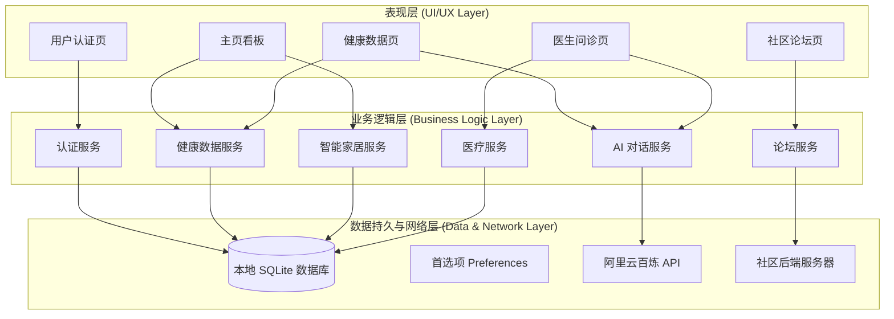

### 1.3 技术栈
- **开发语言**：ArkTS (TypeScript based)
- **UI 框架**：ArkUI (Declarative UI)
- **本地数据库**：RelationalStore (SQLite)
- **网络通信**：@kit.NetworkKit (HTTP)
- **AI 模型**：阿里云通义千问 (Qwen-Turbo)

---

## 2. 模块详细设计

### 2.1 基础模块 (commons)
- **AppDatabase**: 统一管理 SQLite 数据库连接，负责表的创建（DDL）和版本升级。单例模式实现，确保数据库连接的唯一性。
- **UIComponents**: 提供统一的卡片样式、按钮、输入框等原子组件，保证全应用视觉一致性。

### 2.2 认证模块 (features/auth)
- **功能**：处理注册、登录、登出及用户画像管理。
- **核心类**：
  - `UserRepo`: 封装对 `user` 和 `user_profile` 表的增删改查。
  - `LoginPage`: 登录/注册逻辑，使用 `AppStorage` 持久化全局 `currentUser`。

### 2.3 健康模块 (features/health)
- **功能**：展示运动数据、生命体征，提供 AI 健康助手。
- **逻辑**：
  - `HealthDataService`: 管理每日健康数据 (`health_daily`)。如果当日没有数据，自动初始化默认值。
  - `AiService`: 封装 HTTP 请求，调用阿里云 DashScope 接口。支持 `systemPrompt` 注入以设定 AI 角色。
- **AI 助手流程**：用户输入 -> 构建 Prompt (附带用户画像) -> 发送至大模型 -> 流式/全量接收 -> 渲染 UI。

### 2.4 医疗模块 (features/medical)
- **功能**：医生名录查询、模拟在线问诊。
- **实现**：
  - **角色扮演 (Roleplay)**：点击医生进入聊天时，系统生成特定的 System Prompt（如“你是一名心内科医生...”），使通用大模型表现出特定医生的专业性。
  - **本地数据**：医生信息存储在 `doctor` 表中，支持模糊搜索。

### 2.5 社区模块 (features/forum)
- **功能**：发帖、浏览、评论。
- **实现**：
  - 真正的前后端分离模块。前端通过 Restful API 访问 `http://<IP>:8000`。
  - 图片上传使用 `multipart/form-data` 格式。

---

## 3. 数据库设计 (Database Design)

本项目采用 **双数据库架构**，分别应对本地隐私数据存储和云端社区数据同步：
1. **本地数据库 (SQLite)**：存储用户隐私数据（账号、身体指标、健康记录）、智能家居数据及预置的医生数据。
2. **云端数据库 (MySQL)**：存储社区论坛的公开数据（帖子、评论、点赞、用户信息）。

### 3.1 实体关系图 (ER Diagram)

注：本地 SQLite 库与云端 MySQL 库物理隔离，通过应用层 API 进行逻辑交互。

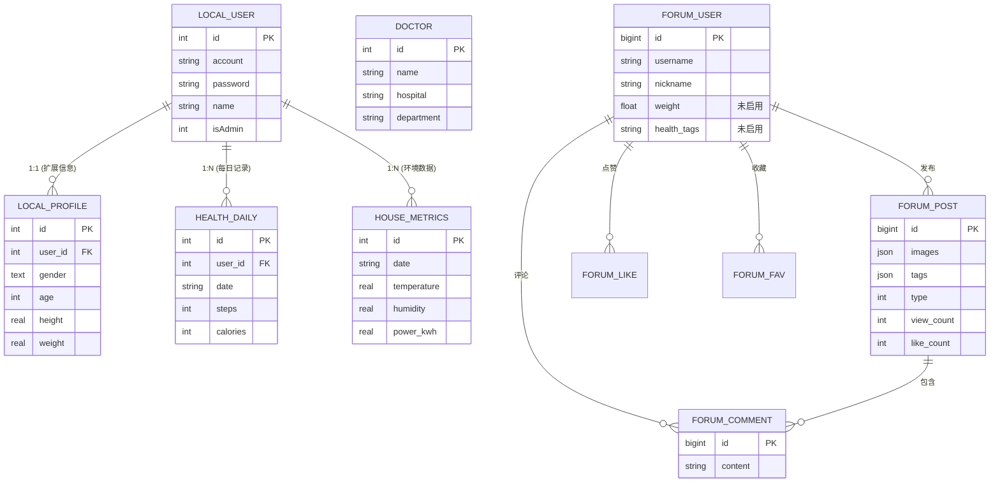

### 3.2 关键表结构说明 (Detailed Schema)

#### 3.2.1 本地 SQLite 数据表
*(基于 `AppDatabase.ets` 定义)*

**(1) user (基础用户表)**
| 字段名 | 类型 | 属性 | 说明 |
|---|---|---|---|
| id | INTEGER | PK, AutoInc | 用户唯一ID |
| account | TEXT | UNIQUE, NotNull | 登录账号 (唯一索引) |
| password | TEXT | NotNull | 密码 (明文/哈希) |
| name | TEXT | | 用户真实姓名/昵称 |
| phone | TEXT | | 联系电话 |
| isAdmin | INTEGER | Default 0 | 角色权限 (0=普通, 1=管理员) |
| created_at | TEXT | Default Now | 注册时间 |

**(2) user_profile (用户健康画像)**
| 字段名 | 类型 | 说明 |
|---|---|---|
| id | INTEGER | PK |
| user_id | INTEGER | FK -> user.id (级联删除) |
| gender | TEXT | 性别 (M/F) |
| age | INTEGER | 年龄 |
| height_cm | REAL | 身高 (cm) |
| weight_kg | REAL | 体重 (kg) |
| body_fat_pct | REAL | 体脂率 (%) |
| target_steps | INTEGER | 每日步数目标 (默认10000) |
| target_calories | INTEGER | 每日消耗目标 (默认500) |

**(3) health_daily (每日综合记录)**
该表采用聚合设计，单行记录涵盖用户当日的所有维度指标。
| 字段名 | 类型 | 说明 |
|---|---|---|
| user_id | INTEGER | FK -> user.id |
| date | TEXT | 日期 (YYYY-MM-DD)，(user_id, date) 唯一索引 |
| steps_current | INTEGER | 当前步数 |
| steps_goal | INTEGER | 当日目标步数 (快照) |
| calories_current | INTEGER | 消耗卡路里 (kcal) |
| heart_rate | INTEGER | 最近一次心率 (bpm) |
| bp_systolic | INTEGER | 收缩压 (mmHg) |
| bp_diastolic | INTEGER | 舒张压 (mmHg) |
| spo2 | INTEGER | 血氧饱和度 (%) |
| sleep_total | REAL | 总睡眠时长 (小时) |
| stress_value | INTEGER | 压力值 (0-100) |

**(4) house_metrics (房屋环境监测)**
| 字段名 | 类型 | 说明 |
|---|---|---|
| id | INTEGER | PK |
| user_id | INTEGER | 归属用户 |
| ts | TEXT | 记录时间戳 |
| energy_kwh | REAL | 实时耗电量 (kWh) |
| net_down_mbps | REAL | 下行网速 |
| co2_ppm | REAL | 二氧化碳浓度 |
| light_lux | REAL | 光照强度 |

**(5) doctor (医生信息库)**
| 字段名 | 类型 | 说明 |
|---|---|---|
| id | INTEGER | PK |
| name | TEXT | 医生姓名 |
| hospital | TEXT | 所属医院 |
| department | TEXT | 科室 |
| title | TEXT | 职称 (如: 主任医师) |
| specialty | TEXT | 擅长领域 |
| fee | REAL | 挂号费/咨询费 |
| priority_base | REAL | 推荐排序权重 (Department + Priority 索引) |

#### 3.2.2 云端 MySQL 数据表 (health_forum)
*(基于 `final_init.sql` 定义，snake_case 命名)*

**(1) forum_user (全域用户表)**
| 字段名 | 类型 | 说明 |
|---|---|---|
| id | BIGINT | PK, AutoInc |
| username | VARCHAR(50) | 唯一用户名 |
| password_hash | VARCHAR(255) | 加密密码 |
| nickname | VARCHAR(50) | 显示昵称 |
| avatar_url | VARCHAR(500) | 头像链接 |
| bio | VARCHAR(200) | 个人签名 |
| *age/weight/health_tags* | - | *已预留字段，业务暂未启用* |

**(2) forum_post (帖子核心表)**
| 字段名 | 类型 | 说明 |
|---|---|---|
| id | BIGINT | PK |
| user_id | BIGINT | FK -> forum_user.id |
| title | VARCHAR(100) | 标题 |
| content | TEXT | 帖子正文 Markdown/HTML |
| images | JSON | 图片URL数组 (["url1", "url2"]) |
| tags | JSON | 标签数组 (["高血压", "饮食"]) |
| type | INT | 帖子类型 (0=普通, 1=公告) |
| view_count | INT | 浏览量 |
| like_count | INT | 点赞数 (缓存聚合) |
| comment_count | INT | 评论数 (缓存聚合) |

**(3) forum_comment (评论表)**
| 字段名 | 类型 | 说明 |
|---|---|---|
| id | BIGINT | PK |
| post_id | BIGINT | FK -> forum_post.id |
| user_id | BIGINT | FK -> forum_user.id |
| content | VARCHAR(500) | 评论内容 |
| created_at | DATETIME | 评论时间 |

**(4) 互动关系表**
- **forum_like**: `(user_id, post_id)` 唯一键，记录点赞状态。
- **forum_fav**: `(user_id, post_id)` 唯一键，记录收藏状态。

---

## 4. 接口与交互设计 (Interface & Interaction Design)

### 4.1 用户认证模块交互

**(1) 登录流程 (Login Sequence)**
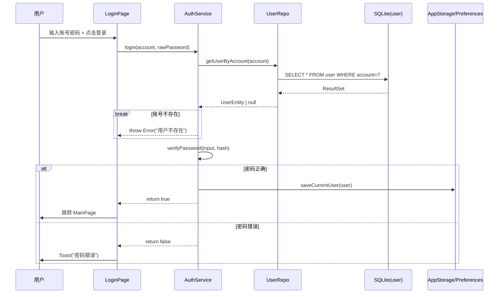

**(2) 注册流程 (Register Sequence)**
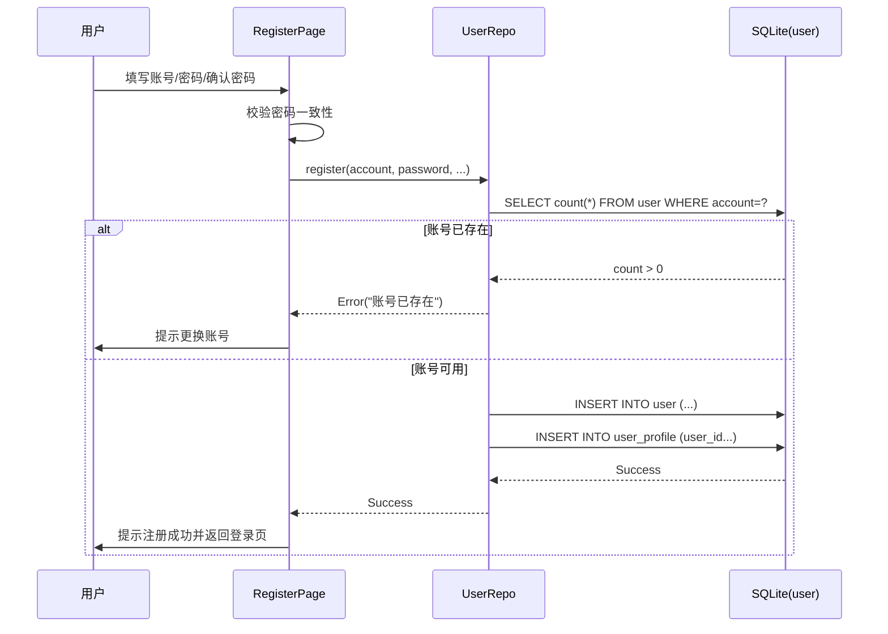

### 4.2 健康管理模块交互

**(1) 健康数据加载流程 (Health Data Loading)**
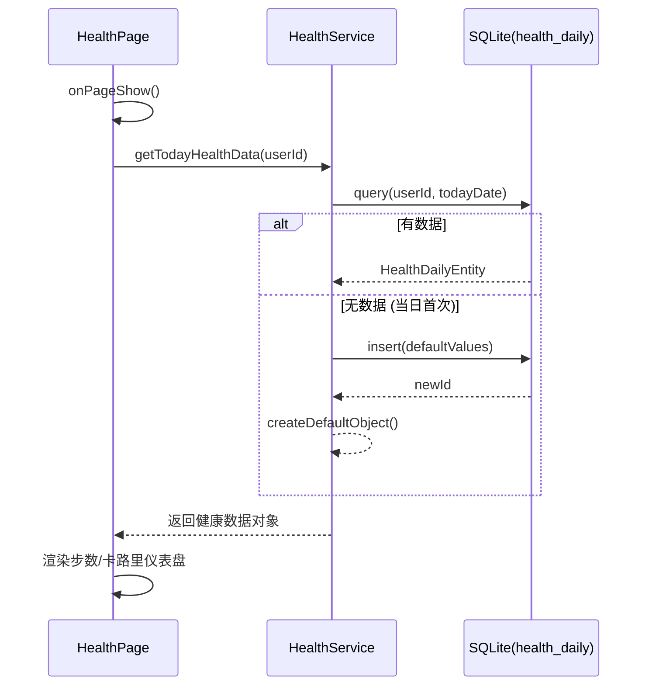

**(2) 数据手动录入/修正 (Manual Update)**
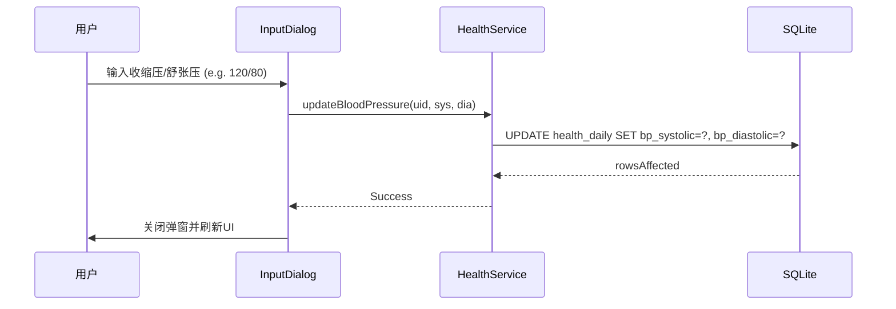

### 4.3 智能医疗与 AI 交互

**(1) 模拟医生问诊 (AI Roleplay)**
*(核心流程：注入 Prompt 实现角色扮演)*
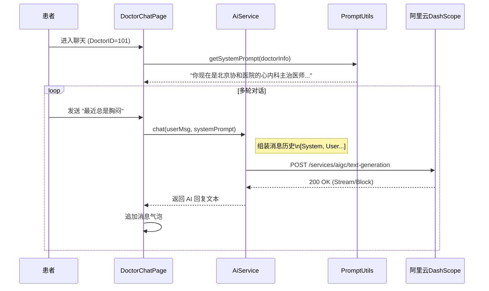

**(2) 医生数据管理 (Admin)**
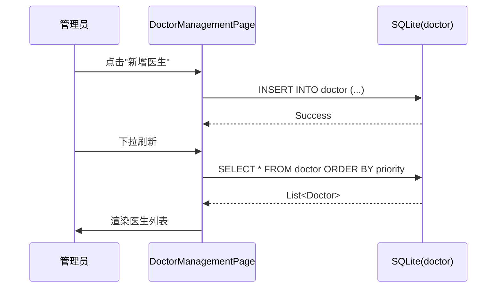

### 4.4 社区论坛模块交互 (Client-Server)

**(1) 帖子流浏览 (Feed Browsing)**
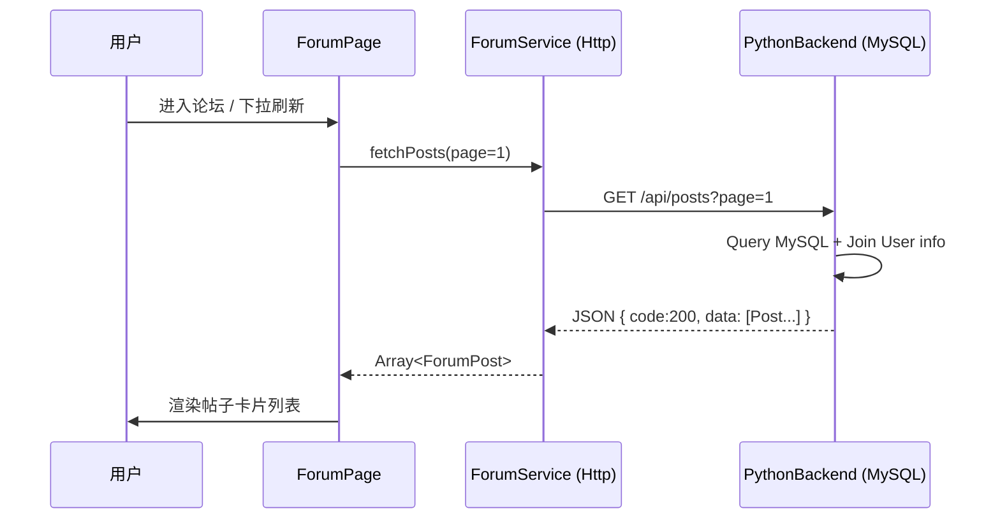

**(2) 发帖流程 (Create Post)**
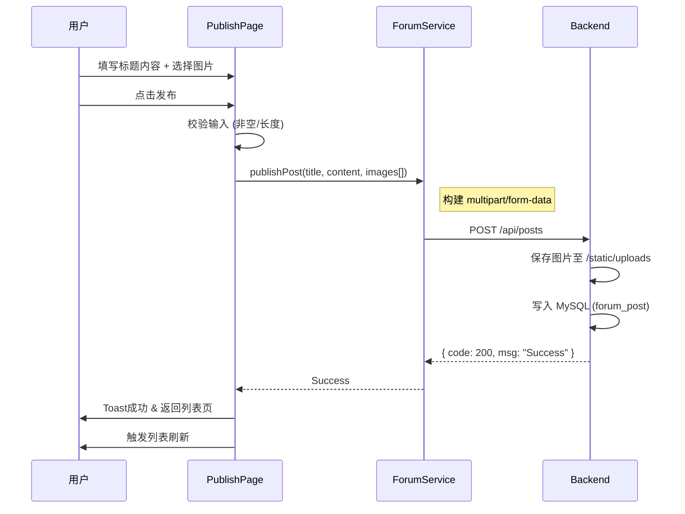

**(3) 互动操作 (Like/Collect)**
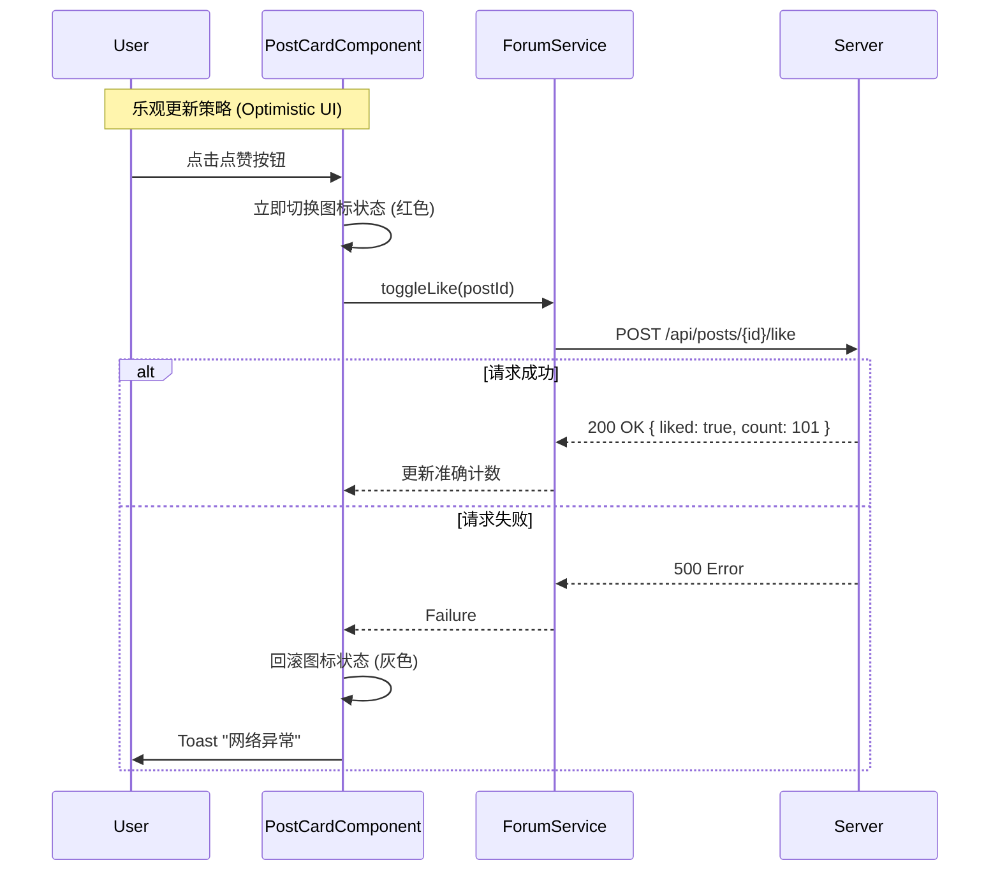

### 4.5 智能家居监控交互

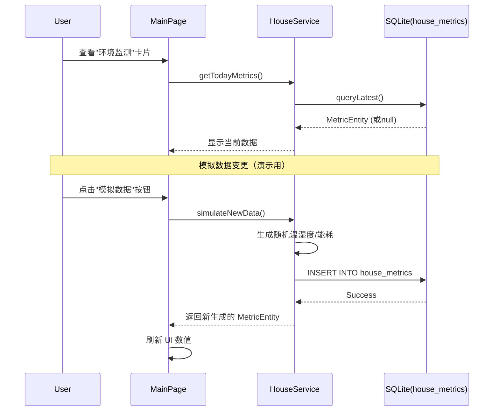

---

## 5. 界面设计 (UI/UX Design)

### 5.1 页面路由表
系统核心页面及其路由配置如下：

| 页面文件名 | 路由名称 (Named Route) | 说明 |
|---|---|---|
| `LoginPage.ets` | `LoginPage` | 此页面仅作为 Entry Wrapper，实际复用 `features/auth` 中的登录视图 |
| `Index.ets` (mainpage) | `MainPage` | 应用主入口，承载底部 Tab 导航 (健康/医疗/论坛/我的) |
| `HealthAssistantPage.ets` | `HealthAssistantPage` | **AI 健康助手**：全屏对话窗口，专注沉浸式问答 |
| `DoctorChatPage.ets` | `DoctorChatPage` | **在线问诊**：模拟即时通讯界面，顶部显示医生信息板 |
| `OnlineConsult.ets` | `MedicalOnlineConsultPage` | **医生大厅**：Grid/List 混合布局展示医生名录 |
| `ForumPage.ets` | `HealthForumPage` | **社区主页**：内嵌 Navigation 容器，独立管理帖子流与发帖路由 |
| `PublishPage` (View) | `PublishPage` | **发帖界面**：表单式布局，支持图文混排预览 |

### 5.2 交互风格与设计规范

本系统针对**老年用户**群体特征，制定了清晰、高对比度且容错率高的交互规范。

#### (1) 全局视觉语言
*   **色彩体系**：
    *   **主色调**：科技蓝 (`#007DFF`)，用于主要按钮、选中状态。
    *   **背景色**：渐变蓝白 (`0xE6F2FF` -> `0xFFFFFF`) ，营造医疗洁净感。
    *   **夜间模式**：系统全量适配深色模式 (Dark Mode)，背景转为深灰 (`#1A1A1A`)，卡片采用悬浮灰 (`#2C2C2C`)，文字颜色智能反转，降低夜间使用刺眼感，保护用户视力。
*   **字体排印**：
    *   次要信息使用灰色 (`#999999`) 弱化，减少视觉干扰。
*   **卡片式设计 (Card UI)**：
    *   所有内容区块采用 **圆角矩形 (Radius=12vp)** + **轻微投影** (`shadow({ radius: 10, color: 'rgba(0,0,0,0.1)' })`)。

#### (2) 导航与反馈机制
*   **混合导航模式**：
    *   **主层级**：使用不同卡片切换核心模块 (健康/医疗/社区)。
    *   **深层级**：社区模块内部使用 `Navigation` 组件实现独立的页面栈管理，保持发帖/详情页的上下文。
    *   **模态交互**：关键操作（如登录/注册、发帖）支持模态切换或状态内联切换（如 Login 页内切换注册模式）。
*   **即时反馈**：
    *   **Toast**：操作成功/失败均触发 `promptAction.showToast`，提示语简练（"注册成功"、"密码错误"）。
    *   **乐观 UI (Optimistic UI)**：点赞、收藏操作采取先变色、后请求的策略，提供零延迟体验。

#### (3) 特定场景交互
*   **AI 对话 (Chat Interface)**：
    *   采用经典的 **左右气泡布局** (右侧用户，左侧 AI/医生)。
    *   **自动滚动**：新消息到达时自动滚动到底部。
    *   **上下文注入**：进入医生聊天时，自动在顶栏展示医生信息(科室/医院)，增强信任感。
*   **表单录入**：
    *   注册/发帖采用 **所见即所得** 的流式布局。
    *   输入框具备清晰的 Placeholder 提示颜色 (`#B0B0B0`)。
