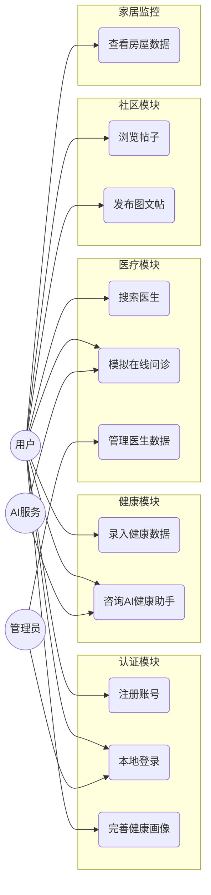
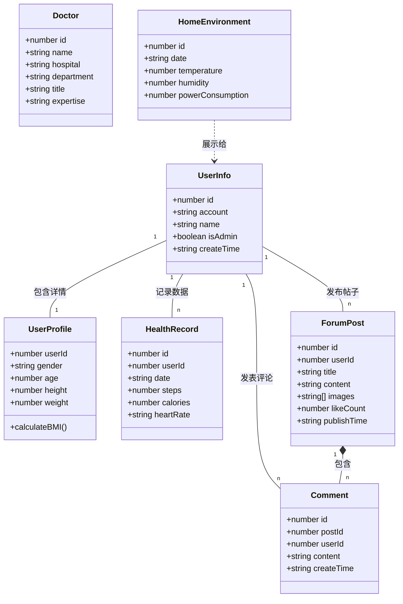
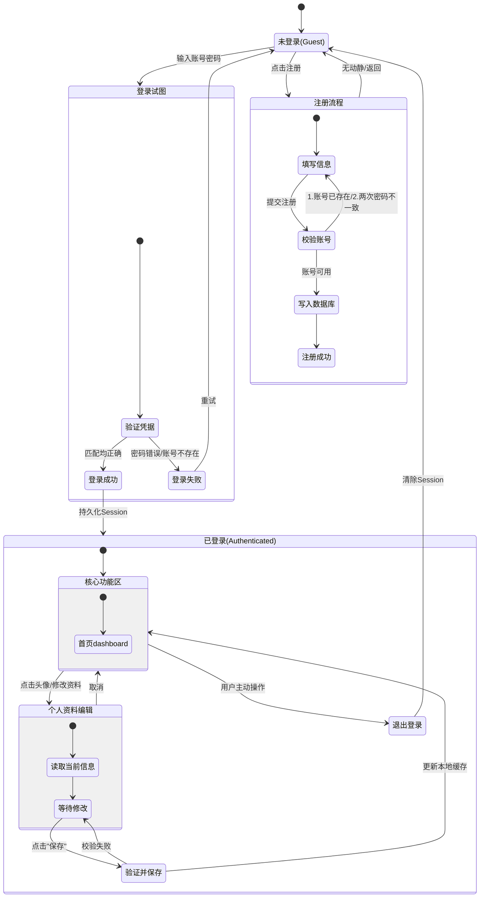
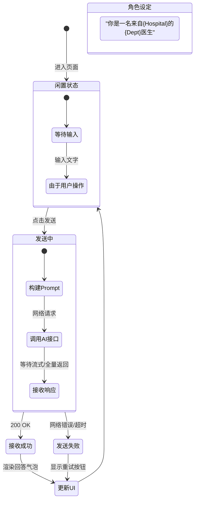
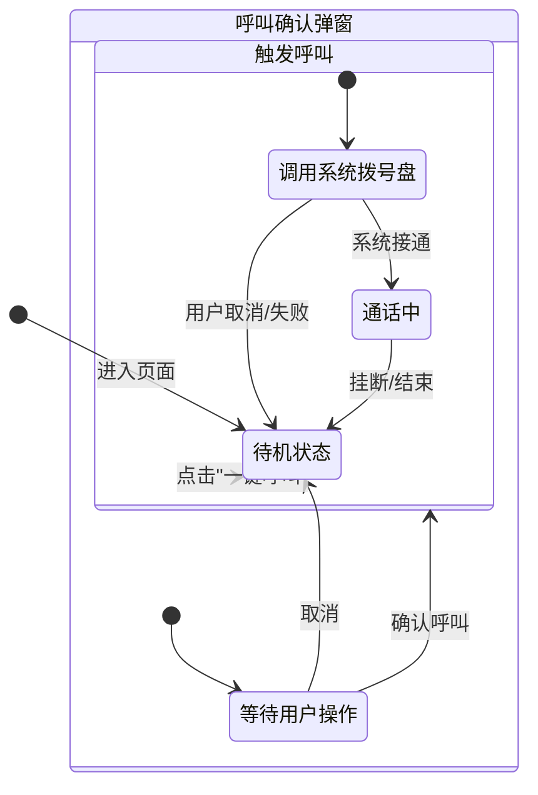
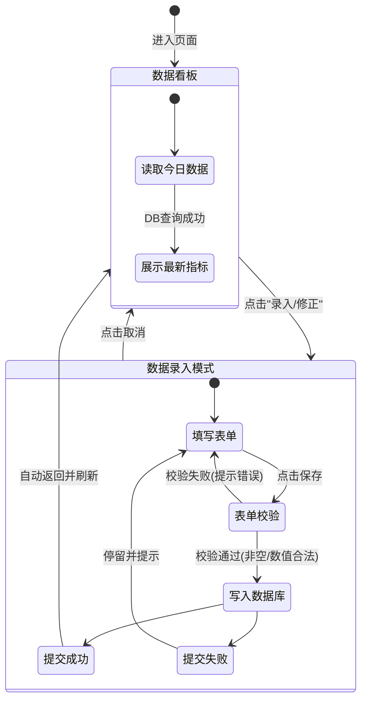
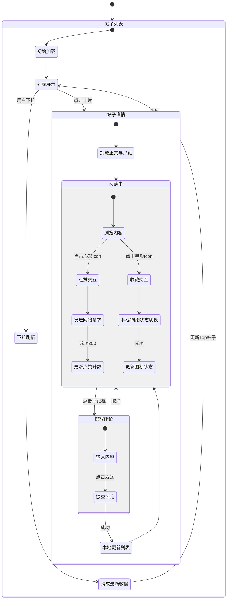
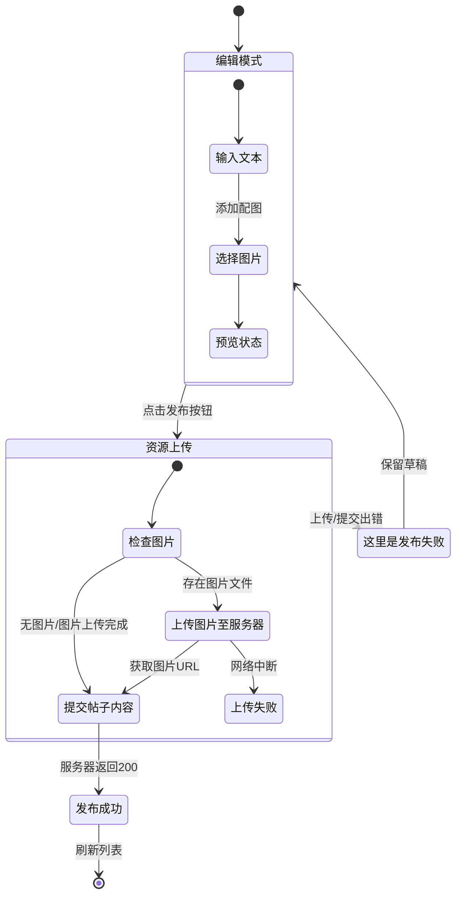
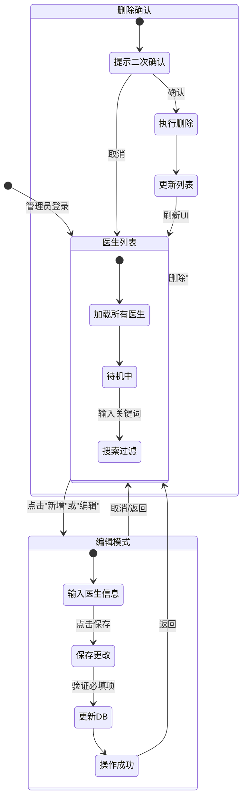

# 华为中控屏项目 - 需求分析与规格说明书

**项目名称：** 中央控制屏（Central Control Screen）  
**目标平台：** 华为鸿蒙OS (OpenHarmony)  
**文档日期：** 2026年1月16日  
**版本：** 2.0

---

## 目录

1. [引言](#1-引言)
2. [总体描述](#2-总体描述)
3. [功能性需求](#3-功能性需求)
4. [非功能性需求](#4-非功能性需求)
5. [系统建模 (UML)](#5-系统建模-uml)
    - [用例图](#51-用例图-use-case-diagram)
    - [类图](#52-类图-class-diagram)
    - [状态图](#53-状态图-state-diagram)

---

## 1. 引言

### 1.1 编写目的
本文档旨在明确 "中央控制屏" 项目的软件需求，详细描述系统必须实现的各项功能及非功能性指标，为开发团队、测试团队及项目干系人提供共同的沟通基础。文档基于当前的代码实现进行逆向梳理与规划更新。

### 1.2 项目背景
随着老龄化社会的到来，居家养老与智慧医疗需求日益增长。本项目构建一个基于 HarmonyOS 的中央控制屏应用，集成健康监测、AI 辅助问诊、社区互动及智能家居控制功能，旨在为老年用户及家庭提供闭环的健康管理服务。

### 1.3 预期的读者和阅读建议
- **开发人员**：了解详细的功能逻辑和数据模型。
- **测试人员**：根据功能点编写测试用例。
- **UI/UX设计师**：理解交互流程。

---

## 2. 总体描述

### 2.1 产品远景
打造一款 "懂你" 的家庭健康管家。不仅记录数据，更通过大模型 AI 提供即时的健康咨询和情感陪伴。

### 2.2 用户特征
- **普通用户（老年人/患者）**：操作习惯简单，字体要求大，需要直观的健康反馈。
- **管理员/医生**：需要查看患者数据，管理医生信息（系统目前已预置管理员入口）。

### 2.3 运行环境
- **操作系统**：OpenHarmony / HarmonyOS Next
- **设备类型**：平板 (Tablet) 或 大屏中控设备
- **网络依赖**：
    - AI 服务需要互联网连接 (阿里云 DashScope)。
    - 论坛社区需要连接自建后端服务器。

---

## 3. 功能性需求

### 3.1 用户认证模块 (Auth Feature)
**优先级：P0**
系统基于本地数据库实现用户体系，保障基础的隐私隔离。

- **FR-AUTH-001 用户注册**：用户输入账号和密码，系统查重后在本地通过 SQLite (`relationalStore`) 创建账户。
- **FR-AUTH-002 用户登录**：验证账号密码，登录成功后持久化存储当前用户状态。
- **FR-AUTH-003 用户画像**：维护用户的身高、体重、年龄、性别等信息，用于后续的 AI 健康分析。

### 3.2 健康管理模块 (Health Feature)
**优先级：P0**
核心功能，结合本地数据记录与云端 AI 分析。

- **FR-HEALTH-001 运动数据看板**：
    - 展示每日步数、消耗卡路里。
    - 计算 BMI 指数。
- **FR-HEALTH-002 健康数据录入**：
    - 用户可手动修正或录入今日的健康体征数据。
- **FR-HEALTH-003 AI 健康助手**：
    - **智能问答**：集成阿里云通义千问 (Qwen-Turbo) 模型。
    - **主动分析**：AI 根据用户画像（如"65岁男性，高血压"）提供个性化健康建议。

### 3.3 智慧医疗模块 (Medical Feature)
**优先级：P1**
模拟真实的互联网医院体验。

- **FR-MEDICAL-001 医生名录**：
    - 展示医生列表，包含姓名、科室、医院、职称。
    - **搜索与筛选**：支持按医生姓名、医院名称或科室进行本地数据库模糊搜索。
- **FR-MEDICAL-002 智能问诊 (Roleplay)**：
    - 用户点击特定医生进入聊天。
    - 系统动态注入 Prompt (系统提示词)，让 AI 扮演该特定医生的角色（如 "你现在是北京协和医院的心内科张医生..."）。
    - 聊天界面模拟真实的医患对话流。
- **FR-MEDICAL-003 管理员功能**：
    - 具备管理员权限的账号可对医生信息进行编辑或删除。

### 3.4 社区论坛模块 (Forum Feature)
**优先级：P2**
真实的前后端分离社交模块。

- **FR-FORUM-001 帖子浏览**：
    - 下拉刷新获取最新帖子列表。
    - 帖子包含标题、内容、图片、作者头像及发布时间。
- **FR-FORUM-002 发布帖子**：
    - 支持图文混排发布。
    - 图片上传至远程服务器 (`/uploads/` 路径)。
- **FR-FORUM-003 评论互动**：
    - 用户可对帖子发表文字评论。

---

## 4. 非功能性需求

- **NFR-001 响应性**：
    - 本地数据库查询（登录、医生搜索）响应时间 < 200ms。
    - 页面跳转无明显卡顿，转场动画流畅。
- **NFR-002 适配性**：
    - UI 需同时适配横屏（中控屏模式）和竖屏操作。
- **NFR-003 数据隐私**：
    - 用户的敏感健康数据（步数、身体指标）优先存储于本地 SQLite 数据库，仅在用户主动发起 AI 咨询时脱敏发送给大模型。
- **NFR-004 健壮性**：
    - 网络断开时，AI 助手和论坛应提示“网络连接不可用”，但本地健康档案和医生列表仍可查看。

---

## 5. 系统建模 (UML)

### 5.1 用例图 (Use Case Diagram)
描述不同角色与系统功能的交互关系。

### 5.2 类图 (Class Diagram)
本图主要展示系统核心业务实体（Entity）及其在数据库中的关联关系，不包含工具类与服务类。

### 5.3 关键业务状态图 (State Diagrams)

#### 5.3.1 用户认证与个人中心状态
描述用户身份获取、会话维持及个人信息管理。

#### 5.3.2 在线问诊/AI对话流程
描述**在线问诊/AI对话**的会话状态流转。

#### 5.3.3 一键呼叫流程
描述紧急情况下的一键呼叫交互。

#### 5.3.4 健康数据录入与展示流程
描述用户手动录入每日健康指标的交互流程。

#### 5.3.5 论坛综合交互流程 (浏览/互动/点赞)
描述用户浏览帖子流及进行评论、点赞、收藏等状态模型。

#### 5.3.6 论坛帖子发布流程
描述图文帖子从编辑到发布的网络交互状态。

#### 5.3.7 医生信息管理流程 (管理员)
描述管理员对医生数据进行增删改的后台管理流程。

